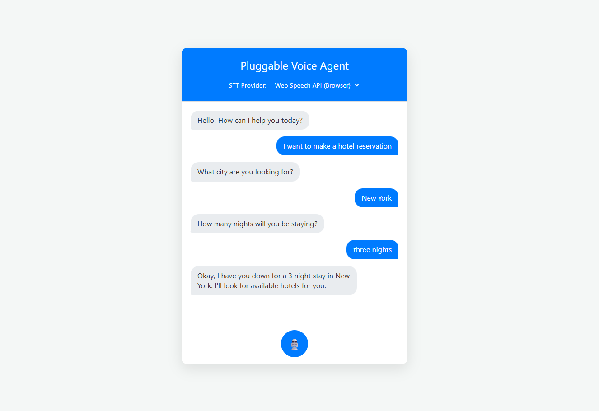

# PVA: Pluggable Voice Chatbot POC

**PVA** is a full-stack proof-of-concept (POC) demonstrating a modern, voice-first conversational AI chatbot. The core of this project is its modular architecture, which uses **Amazon Lex V2** for Natural Language Understanding (NLU) and allows the user to dynamically switch between multiple Speech-to-Text (STT) engines in real-time.

This project is built with **Next.js**, leveraging its full-stack capabilities to provide both a reactive user interface and a serverless backend in a single, unified codebase.

_Demo_


---

## ✨ Key Features

- **Dynamic STT Engine**: Seamlessly switch between different STT providers to compare accuracy, speed, or cost.
  - **Web Speech API** (Browser-native)
  - **Google Cloud Speech-to-Text**
  - **AssemblyAI**
- **Advanced NLU**: Utilizes **Amazon Lex V2** to understand user intents and extract key information (slots) from conversations.
- **Voice-First Interaction**: The primary input method is voice, processed in real-time for a natural conversational experience.
- **Full-Stack Architecture**: Built with **Next.js App Router**, using React Server Components for the UI and API Routes for a robust, serverless backend.
- **Real-time Conversation UI**: A clean, chat-style interface that displays the conversation history between the user and the bot.

---

## 🛠️ Tech Stack & Services

This project integrates a variety of modern web and cloud technologies.

- **Frontend**:
  - **Next.js 14+** (App Router)
  - **React 18**
  - **CSS** (Global Styles)
- **Backend**:
  - **Next.js API Routes** (Serverless Functions)
- **AI & Cloud Services**:
  - **Amazon Lex V2**: For Natural Language Understanding and conversation management.
  - **Google Cloud Speech-to-Text**: For high-accuracy, cloud-based speech recognition.
  - **AssemblyAI**: A developer-friendly API for speech recognition.
  - **Web Speech API**: For browser-native, client-side speech recognition.
- **Core Libraries**:
  - `axios` for HTTP requests.
  - `@aws-sdk/client-lex-runtime-v2` for interacting with Amazon Lex.
  - `@google-cloud/speech` for the Google STT service.
  - `assemblyai` for the AssemblyAI STT service.

---

## 🚀 Getting Started

Follow these instructions to get a copy of the project up and running on your local machine.

### **1. Prerequisites**

- **Node.js**: Version 18.17 or later.
- **Cloud Service Accounts**:
  - An **AWS Account** with an Amazon Lex V2 bot configured.
  - A **Google Cloud Platform Account** with the Speech-to-Text API enabled and service account credentials (`.json` file).
  - An **AssemblyAI Account** to get an API key.

### **2. Clone the Repository**

```bash
git clone [https://github.com/kaio-giovanni/pluggable-voice-agent.git](https://github.com/kaio-giovanni/pluggable-voice-agent.git)
cd pluggable-voice-agent
```

### **3. Install Dependencies**

```bash

npm install
```

### **4. Configure Environment Variables**

Create a file named `.env.local` in the root of the project. You can do this by copying the example file:

```bash

cp .env.example .env.local
```

Now, open `.env.local` and fill in the required values from your cloud service accounts.

```
# .env.local

# AWS Credentials (use an IAM user with Lex permissions)

AWS_ACCESS_KEY_ID=YOUR_AWS_ACCESS_KEY
AWS_SECRET_ACCESS_KEY=YOUR_AWS_SECRET_KEY
AWS_REGION=us-east-1 # The region your Lex bot is in

# Lex Bot Information

LEX_BOT_ID=YOUR_BOT_ID_FROM_AWS_CONSOLE
LEX_BOT_ALIAS_ID=YOUR_BOT_ALIAS_ID_FROM_AWS_CONSOLE

# Google Cloud STT Credentials

# The path should be relative to the project's root directory

GOOGLE_APPLICATION_CREDENTIALS=./path/to/your/google-credentials.json

# AssemblyAI API Key

ASSEMBLYAI_API_KEY=YOUR_ASSEMBLYAI_KEY
```

### **5. Run the Application**

Start the Next.js development server:

```bash

npm run dev
```

Open your browser and navigate to `http://localhost:3000` to see the application in action.

---

## 🏛️ Architectural Overview

The application follows a simple but powerful data flow, all handled within the Next.js framework:

- Client (React Component): The user selects an STT provider and clicks the record button. The browser's MediaRecorder or SpeechRecognition API captures the audio.
- API Route (Next.js):
- The client sends the captured audio (or transcribed text) to a Next.js API Route (/api/process-audio or /api/process-text).
- This serverless function acts as a secure backend.
- STT Processing: The API route routes the audio to the selected STT provider (Google or AssemblyAI) for transcription.
- NLU Processing (Amazon Lex): The transcribed text is sent to the Amazon Lex V2 bot.
- Response: Lex processes the intent, manages the conversation state, and returns a response message.
- UI Update: The API route sends the final bot response back to the client, which updates the chat UI.

---

## Author

|                     |
| --------------------------------------------------------------------------------------- |
| <p align="center"> <a href="https://github.com/kaio-giovanni"> @kaio-giovanni </a> </p> |
